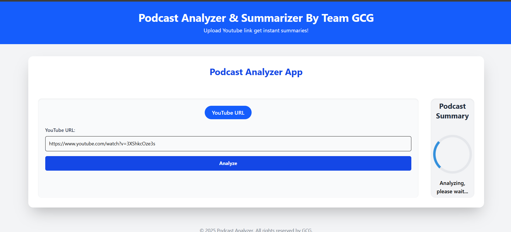
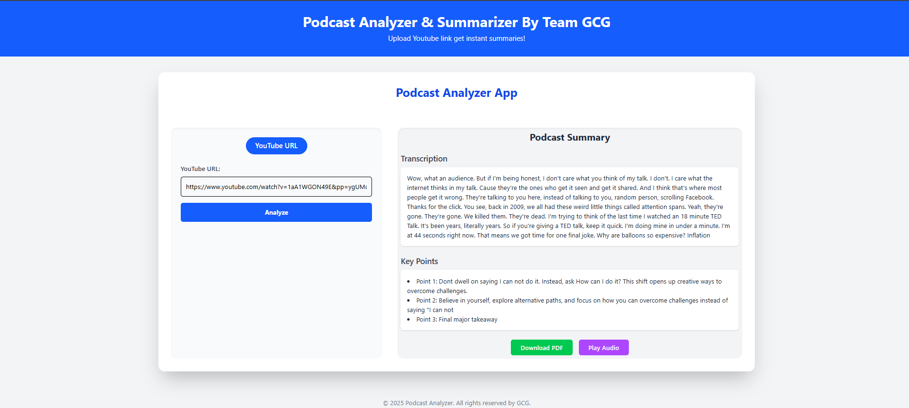

Podcast Analyzer is a powerful tool that takes a podcast URL as input and returns:

✅ A summarized audio version  
✅ A well-formatted PDF transcript  

This is especially helpful for listeners who want to quickly understand long-form audio content or repurpose podcast material for study, accessibility, or archiving.

---

## 🖼️ Screenshot





## 🚀 Features

- 🔗 Input a podcast episode URL (YouTube)
- 🎙️ Converts audio to text using advanced speech recognition
- 🧠 Analyzes and summarizes content using NLP
- 📄 Exports PDF with clean formatting
- 🔊 Optionally returns a short audio summary using TTS (text-to-speech)

---

## ⚙️ Tech Stack

- Frontend: React.js
- Backend: Node.js, Express.js
- Speech-to-Text: [Whisper API](https://openai.com/research/whisper) or similar
- Text Summarization: OpenAI / HuggingFace Transformers
- PDF Generation: pdfkit 
- Audio Output: gTTS / pyttsx3

---

## 📦 Installation

1. Clone the repository:
```bash
cd podcast-analyzer
